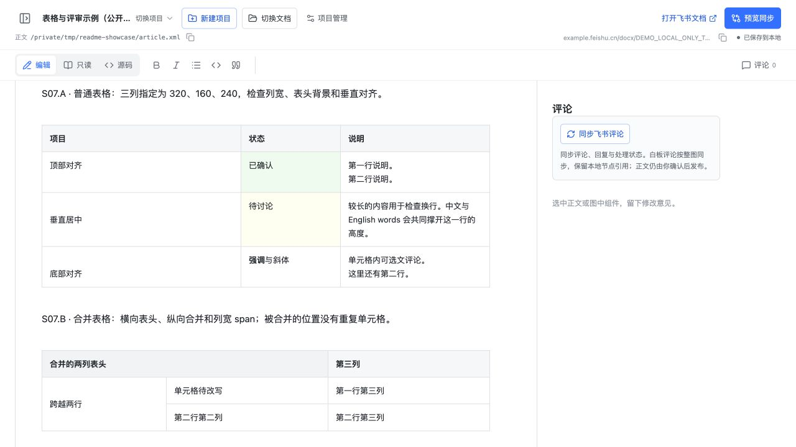

# 本地飞书文档

**feishu-doc-local** 是基于[官方 lark CLI](https://github.com/larksuite/cli) 的 **DocxXML 文档交换格式**独立实现的本地渲染编辑器。它解析 XML，通过 Tiptap / ProseMirror 等组件在浏览器和 Obsidian 中渲染、编辑文档，不嵌入飞书网页。

正文保存为本地 `.xml`，评论、回复和处理记录保存在相邻 `.review.json`，AI 工具可以直接读文件继续改稿。DocxXML 是 XML 文本；JSON 是本项目的反馈协议。精确格式见[写稿协议](docs/writing-protocol.md)。

官方 CLI 用于可选的飞书同步：关联文档、预览差异后拉取或推送，并独立同步评论。CLI 由用户安装并管理登录和权限；纯本地编辑无需飞书账号、CLI 或 AI 服务。

## 项目能力

- **编辑、只读、源码**三种模式，正文和已提交评论自动保存。
- 支持标题、列表、富文本、代码、公式、分栏、图片，以及部分白板预览和图源编辑。
- 表格支持单元格编辑，呈现列宽、合并单元格和背景色；结构与样式可通过源码修改。
- 选文评论、回复、解决与引用定位；文件列表、文章目录和评论面板可收起。
- 可先写本地稿，之后再关联飞书；正文同步提供类似 Git diff 的差异预览，评论独立同步。
- 同步前保存旧稿；可预览并恢复上一快照，恢复前也会存档当前版本。

## 界面预览

以下截图使用公开样稿展示本地界面。同步预览的另一侧为本地合成数据，仅演示差异与确认流程，不作为云端验收。

浏览器中的「S07 · 表格、列宽与合并」：



<!-- 待真实 Obsidian GUI 截图落盘后，在此展示同一公开样稿的「S07 · 表格、列宽与合并」；预期路径：docs/images/obsidian-table.jpg。 -->

正文同步先预览两端差异，再确认拉取或推送：


## 选择使用方式

| 版本 | 需要安装什么 | 飞书同步 |
| --- | --- | --- |
| 静态浏览器版 | 桌面 Chrome；打开部署好的网页并授权文档目录 | 不支持 |
| 本地服务版 | Node.js 22.13+ | 可选，需要官方 CLI |
| Obsidian 基础插件 | 桌面 Obsidian 1.8+，手动安装插件 | 不支持 |
| Obsidian 飞书同步扩展 | 基础插件 + 已安装、已登录的官方 CLI | 支持，不需要启动网页服务 |

四种方式共用编辑器与文件格式。Obsidian 基础插件无需额外安装 Node；同步扩展使用应用自带运行时，但通过 npm 安装的 CLI 自身仍需要系统 Node。

## 开始使用

### Obsidian

从 [Releases](https://github.com/To-Re/feishu-doc-local/releases) 下载基础插件，将解压后的 `feishu-doc-local/` 放入库的 `.obsidian/plugins/`，在第三方插件设置中启用。打开命令面板，执行“本地飞书文档：打开 XML 文档”。

需要同步飞书时，再安装可选扩展并配置官方 CLI 路径。详见[基础插件安装](obsidian-plugin/README.md)和[同步扩展配置](obsidian-sync-plugin/README.md)。

### 本地网页版

从源码启动：

```sh
npm ci
npm run build
npm start
```

打开 [http://127.0.0.1:4318/](http://127.0.0.1:4318/)，即可使用欢迎样稿，或创建自己的本地项目。指定文件运行：

```sh
npm start -- --file /absolute/path/article.xml
```

如果下载的是预构建本地服务包，解压后直接 `npm start` 即可。页面可用期间需保持服务运行；退出进程后，本地链接会无法访问。同步配置见[项目与飞书同步](docs/projects-and-sync.md)。

### 不安装 Node 的浏览器版

通过桌面 Chrome 打开已部署的静态网站，选择本地文档目录。使用者不需要 Node；托管者从源码构建 `dist/browser/` 后部署到 HTTPS 静态站点即可。

```sh
npm ci
npm run build:browser
npm run preview:browser
```

本地预览地址为 [http://127.0.0.1:4319/](http://127.0.0.1:4319/)。需要浏览器目录 API；不要通过 `file://` 双击 HTML 使用。详见[浏览器版说明](docs/browser-version.md)。

## 和 AI 一起改稿

```text
articles/
├── article.xml          # 正文
├── article.review.json  # 评论、回复、操作和同步记录
└── resources/           # 文档引用的素材
```

直接告诉你的 AI 工具：“请阅读 article.xml 和相邻的 article.review.json，处理我留下的意见。”无需复制或导出反馈。移动文章时，同时保留 JSON 和引用资源。

## 使用边界

- 目前以 macOS 验证；Obsidian 插件需手动安装，移动端和独立弹出窗口尚未支持。
- 白板、电子表格和动态块不是完整飞书编辑器：白板组件评论同步到飞书时按整图定位；电子表格内部编辑暂不支持。
- 飞书可能规范化格式，部分 CLI 版本存在内容丢失问题；复杂格式请先用副本验证。具体支持范围、往返差异与实测进度见[格式支持与限制](docs/style-coverage.md)。
- 本地服务只监听 `127.0.0.1`，不用于公网多用户托管。自动保存不会自动发布到飞书。

更多说明：[使用文档](docs/README.md) · [贡献指南](CONTRIBUTING.md) · [安全说明](SECURITY.md)

项目代码采用 [MIT](LICENSE)；第三方组件、图标和字体遵循各自许可证，见[第三方通知](THIRD_PARTY_NOTICES.md)与[素材来源](docs/assets-and-attribution.md)。
