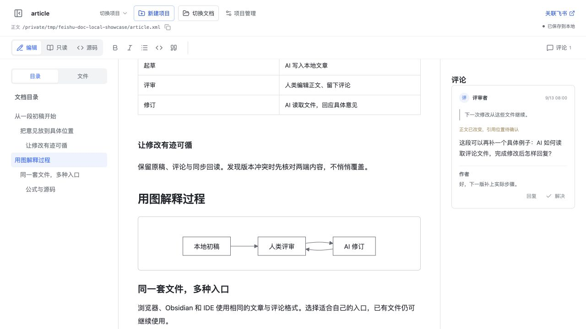
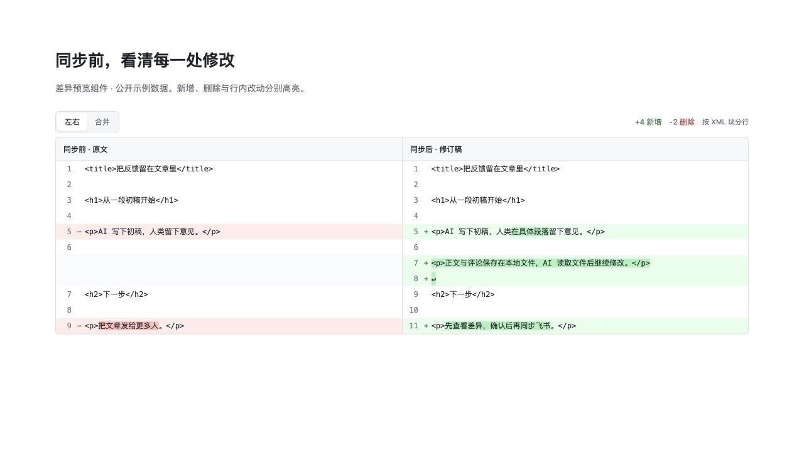

# 本地飞书文档

**feishu-doc-local** 是一个在本机运行的飞书格式文档编辑与评审工具。打开本地文件，在浏览器写文章、看排版、留评论，再让你已有的 AI 工具读取文件继续改稿。文章成熟后，可以按需关联飞书文档，直接拉取或推送，也可先查看差异。

这是独立社区项目，与飞书 / Lark 官方没有隶属关系。纯本地使用不需要飞书账号、CLI 或模型服务。

**AI 开发项目**：本项目自身代码由 **OpenAI Codex** 生成并持续迭代，[@To-Re](https://github.com/To-Re) 负责需求、设计决策和人工体验验收。开发与测试过程包含多个 AI agent 的协作；贡献者分工见 [CONTRIBUTORS.md](CONTRIBUTORS.md)。

## 下载首个公开预览版

从 [v0.0.1 发布页](https://github.com/To-Re/feishu-doc-local/releases/tag/v0.0.1) 下载浏览器静态资源、本地服务包、Obsidian 基础插件或可选飞书同步扩展。四个包分开提供，并附 `SHA256SUMS`；使用差异和安装步骤见下文，[发布说明](docs/releases/v0.0.1.md) 列出已验证范围与限制。

**v0.0.1 是首个公开预览版。** 开发期间的 0.1–0.4 内部迭代号统一重新编号为 0.0.1，历史验收记录保留当时版本。插件内真实发布、评论云端同步与完整双向往返仍待验收，推送会自动存档旧稿并更新本地；首次使用建议先查看差异，核对飞书实际结果。

## 选择使用方式

| 版本 | 安装成本 | 当前能力 |
| --- | --- | --- |
| 浏览器版 | 打开静态网站，使用桌面 Chrome 授权一个目录；不安装 Node 或 CLI | 本地编辑、源码、评论、目录内切换文档；不接入飞书同步 |
| 本地服务版 | Node.js 22.13+；需要同步时另装官方 CLI | 完整本地编辑、项目配置、资源树、备份和可选飞书同步 |
| Obsidian 基础插件 | 安装本地插件；不额外安装 Node 或启动服务 | 编辑与格式工具、只读、源码、评论与回复、草稿恢复、文章目录、引用资源和库内文档切换 |
| Obsidian 飞书同步扩展 | 基础插件 + 自行安装并登录官方 CLI；npm 安装 CLI 时仍需 Node | 顶栏导入与同步按钮，手动关联与新建飞书文档、正文差异确认、资源下载、评论双向同步；不启动网页服务 |

`master` 维护网页与 Obsidian 两类入口，以上四种交付形态共用 DocxXML 和相邻 `.review.json`。Obsidian 同步扩展依赖基础插件；只做本地写作不必安装同步扩展。实验性 IDEA / GoLand 插件已暂停维护，不包含在本次公开版本中。

当前以 macOS 为开发验证平台。公开发布前的 Obsidian 1.12.7 实测中，内部基础插件 0.4.0 与同步扩展 0.3.0 已验证简化工具栏、从飞书导入新文档、图片与附件显示，以及从顶部预览后确认拉取。真实测试使用官方 CLI 1.0.95，正文、块 ID、旁置记录和 18 个资源经过磁盘核对。早期版本另已验证本地正文编辑与评论生命周期；插件内真实发布及评论云端同步仍待验收。具体步骤与边界见 [2026-09-13 验证记录](docs/validation-2026-09-13-plugins.md)。

### 浏览器版：不安装运行环境

浏览器版可托管为静态网站。打开页面后选择一个本地目录，再新建或打开其中的 XML。页面不会把文章上传给托管网站。首次使用需要在浏览器的目录选择器中授予读写权限；本版刷新后需要重新选择目录，不在浏览器数据库里存正文或凭据。

首版需要桌面 Chrome、HTTPS 或 localhost 安全上下文，以及 File System Access API。Safari、Firefox 或不提供目录 API 的内置浏览器会显示不支持说明，不伪装成已经自动保存。详细说明见 [浏览器版](docs/browser-version.md)。当前不提供飞书同步、任意绝对路径打开或共享用户目录下的项目索引。

开发者生成静态资源和本地预览：

```sh
npm ci
npm run build:browser
npm run preview:browser
```

部署目录是 `dist/browser/`，包含 HTML、JS、CSS、字体和许可证，可用于 Cloudflare Pages 等静态托管。构建需要 Node；访问已部署网站的用户不需要。预览默认地址为 [http://127.0.0.1:4319/](http://127.0.0.1:4319/)。

### Obsidian 插件

从 [v0.0.1 发布页](https://github.com/To-Re/feishu-doc-local/releases/tag/v0.0.1) 下载基础插件 ZIP，解压后将其中的 `feishu-doc-local/` 目录放到 Obsidian 库的 `.obsidian/plugins/`，在第三方插件设置中启用“本地飞书文档”，再执行命令“本地飞书文档：打开 XML 文档”。插件直接调用 Obsidian 的本地文件接口，不依赖网页服务。目前为手动安装，尚未上架社区插件目录。

基础插件要求桌面 Obsidian 1.8.0+，支持编辑、只读和源码模式，提供格式工具与引用资源浏览；在正文或图片、公式、白板上评论，回复和解决意见。正文与已提交评论自动保存到 XML 和旁置 JSON。左侧文章目录按实际标题层级跳转，命令可新建和切换库内文档。无效源码、未发送评论和未应用的图源修改保存在插件本地恢复记录；重新打开后明确选择恢复，原文件缺失时可恢复为新文件。

需要与飞书持续迭代时，再安装 [飞书同步扩展](obsidian-sync-plugin/README.md)：将其发布包放入 `.obsidian/plugins/feishu-doc-local-sync/` 并手工启用，通过命令“配置官方 CLI 与项目路径”填写已安装、已登录的官方 CLI **绝对路径**。npm 版 CLI 可另填 Node 的绝对路径，避免图形应用找不到运行环境；项目配置文件可选择本地服务版已有的 `projects.json`。配置保存后不会运行 CLI。

打开文稿后，顶栏显示“从飞书导入”；已有绑定时直接显示“拉取”、“推送”、“关联设置”、“预览差异”、“同步评论”和“打开飞书”，未绑定时显示“关联”。文档切换使用 Obsidian 文件列表，项目管理保留在命令面板。扩展会识别项目索引和旁置 JSON 中的既有绑定，发现历史记录时提供恢复关联入口。正文可以直接拉取或推送，也可先预览差异；两端都有修改时需要核对后确认。推送成功后自动更新本地正文与资源，旧稿存档；评论、回复与状态同步另有范围确认。扩展复用相同的双端校验和备份逻辑；启动和自动保存不会调用 CLI。它使用 Obsidian 自带运行时，不要求另开 Node 服务；但 npm 版官方 CLI 自身仍需要系统 Node。当前没有插件内登录按钮，用户先按官方说明配置应用、完成 `lark-cli auth login`，扩展再复用该登录状态。基础插件与扩展的构建和安装见各自说明。

### 本地服务版：完整编辑与飞书同步

需要 Node.js **22.13 或更新版本**。下载 [v0.0.1 本地服务包](https://github.com/To-Re/feishu-doc-local/releases/tag/v0.0.1)，解压并进入 `feishu-doc-local/` 后运行：

```sh
npm start
```

发布包已包含运行代码，无需安装依赖或执行构建；也可以直接运行 `node dist/server/start.js`。从源码开发时运行：

```sh
npm ci
npm run build
npm start
```

浏览器打开 [http://127.0.0.1:4318/](http://127.0.0.1:4318/)。首次启动会创建一份可编辑的本地样稿，后续保留你的修改。打开自己的 DocxXML 文件：

```sh
npm start -- --file /absolute/path/article.xml
```

本地服务只在自己的电脑上运行，不需要部署服务器。在页面中新建项目时，可以选择“仅保存在本地”；之后再关联已有飞书文档，或明确选择新建并发布。

## 文件就是协作接口

```text
articles/
├── article.xml          # 正文：官方 CLI 的 DocxXML 文本
├── article.review.json  # 评论、回复、操作记录、同步基线与资源映射
└── resources/           # 当前文章引用或下载的素材
```

正文与已提交评论自动落盘。你可以直接告诉 AI：“请阅读 article.xml 和旁边的 article.review.json，处理我留下的意见。”项目不内置 AI，不要求复制反馈或安装专用 AI 插件。

这里的 XML 是飞书 CLI 的文档交换格式，不是 Word `.docx` 文件，也不是普通 HTML。当前不提供 Markdown 文档编辑。反馈 JSON 是本项目的本地协议，不能直接作为飞书评论导入格式。

本地服务版与 Obsidian 同步扩展默认项目索引为 `~/.lark-review/projects.json`，使用相同的项目协议。旧实例保留原位置，该目录名为兼容已有数据而保留。索引只记录文章位置和关联，不集中存放正文或评论。详见 [本地协议](docs/protocol.md) 与 [项目与同步指南](docs/projects-and-sync.md)。

## 能做什么

- **编辑、只读、源码三种模式**：常见富文本直接编辑，DocxXML 源码校验通过后保存；无改动往返保留原 XML，未知结构保留原文。
- **评论与 AI 接力**：两种可视模式均可选文评论，支持回复、解决与引用定位。公式、图片、附件和白板可整体评论；有节点结构的白板支持本地组件引用。
- **文件导航与文章目录**：按实际标题层级跳转，目录可折叠。浏览器版和 Obsidian 通过各自的文件入口换稿。Obsidian 可浏览当前稿件的引用资源，安装同步扩展后可管理项目；服务版也有多项目管理和引用资源树。外部 AI 修改文件后，空闲编辑器自动读取，存在未保存输入时提示冲突。
- **可选飞书同步**：正文用“拉取”“推送”直接操作，类似 Git diff 的差异预览可以按需打开。推送及新建飞书文档成功后自动更新本地，旧稿和同步记录存档；冲突或结果不确定时停止，避免覆盖新修改或重复发布。评论保持独立同步入口。

支持范围包括标题、列表、引用、高亮、代码、表格与合并单元格、公式、分栏、图片、附件以及部分白板预览。可直接打开 [综合格式样稿](examples/compatibility.xml)、[本地资源样稿](examples/local-resources.xml)、[白板样稿](examples/whiteboards.xml) 体验。

## 界面






截图使用公开样稿与演示评论；目录截图中的正文是早期共享渲染样稿，IDE 相关文字不代表本次包含 IDE 插件。第三张由项目实际 `XMLDiff` 组件渲染示例差异，用于说明左右对比与高亮；它不是飞书同步回执，也不代表截图中的改动已经发布。

## 可选：连接飞书

项目通过外部命令调用 [官方 lark CLI](https://github.com/larksuite/cli) 的 DocxXML、文档、资源与评论协议，CLI 不随本项目分发。先按官方说明安装 CLI 并配置自己的身份和权限，再创建可信的本机配置文件，例如 `~/articles/cli.json`：

```json
{"command":"lark-cli","args":["--as","bot"]}
```

```sh
npm start -- --file ~/articles/article.xml --cli-config ~/articles/cli.json
```

随后在页面关联飞书目标。服务版的 CLI 命令只从启动时指定的本机配置读取；Obsidian 扩展只从插件设置读取可信的绝对路径和固定参数。这些入口均不接受文章内容中的可执行命令，不发起登录，也不读取或管理 CLI 凭据。

其他 CLI 可以通过适配相同的公共命令边界接入；这些实现不是安装或运行本项目的前提，也不随本仓分发。配置与权限说明见 [同步指南](docs/projects-and-sync.md)。

## 当前限制

- **尚未全面复刻飞书样式。** 本地 Mermaid 排版、白板预览与飞书存在差异；不提供原生白板拖拽编辑，也不提供电子表格内部编辑器。未知动态块保留 XML 并显示占位。详见 [样式覆盖矩阵](docs/style-coverage.md)。
- **评论定位存在平台边界。** 本地白板组件意见同步到飞书时定位整张白板，并保留组件说明；不能假称支持飞书内部画板锚点的完整往返。
- **CLI 版本会影响发布结果。** 官方 v1.0.95 已完成 Mac 文档、素材和评论往返验收，但该版本仍复现行内附件后文丢失；云端也会规范化部分结构。发布前保留备份并核对差异，不能把“协议兼容”理解为所有样式无损。见 [官方 CLI 验收](docs/official-cli-mac-2026-09-13.md)。
- **版本功能不同。** 本地服务版与 Obsidian 同步扩展可调用本机 CLI；静态浏览器版与 Obsidian 基础插件只在本地工作。插件目前手动安装，Obsidian 独立弹出窗口和移动端不在本次交付范围。
- **这是单机工具。** 服务只监听 `127.0.0.1`，不提供多用户托管、账号体系或远程服务安全边界。自动保存不会自动向飞书发送正文。

历史样稿中的示意 token 只用于保留性测试，不能当作真实云资源发布。已有验收事实与阶段记录保存在 [历史说明](docs/validation-history.md)，不以旧测试数量代表当前状态。

## 开发与贡献

```sh
npm run typecheck
npm test
npm run build
node scripts/generate-third-party-notices.mjs --check
```

静态浏览器版改动另运行 `npm run build:browser`；Obsidian 插件改动另运行对应目录中的 `npm run typecheck`、`npm test` 和 `npm run build`。不要把模拟宿主测试称为真实应用验收。构建工具需要 Node，但安装已构建的 Obsidian 基础插件无需安装 Node。

HTTP 测试使用临时目录和本机回环端口；默认测试不访问飞书、不读取凭据。详见 [贡献指南](CONTRIBUTING.md)、[安全说明](SECURITY.md) 和 [素材来源](docs/assets-and-attribution.md)。

本项目代码采用 [MIT License](LICENSE)。第三方代码、图标和字体保留各自许可证，见 [第三方通知](THIRD_PARTY_NOTICES.md)。插件安装包的检查范围、摘要及隐私扫描说明见 [发布包审计记录](docs/release-audit-2026-09-13.md)。交互思路参考 [Human Review](https://github.com/petergyang/human-review)；本仓未将其作为代码或运行时依赖。
